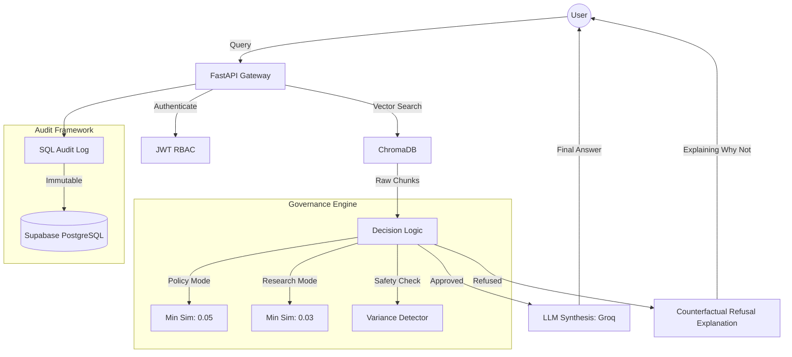

# VeriSource AI 🛡️

<div align="center">

**Enterprise-Grade, Evidence-First Document Verification Platform**  
*Deterministic RAG (Retrieval-Augmented Generation) with Advanced Governance.*

[](https://python.org)
[](https://react.dev)
[](https://fastapi.tiangolo.com/)
[](https://trychroma.com)
[](https://groq.com)
[](https://vitejs.dev/)

</div>

---

## 🎯 Vision & Purpose

**VeriSource AI** is a specialized platform built for high-stakes environments where **accuracy is mandatory and hallucinations are unacceptable**. Unlike generic chatbots, VeriSource strictly synthesizes answers from authenticated document sources (PDFs), providing a mathematical guarantee of groundedness through a custom **Governance Engine**.

Ideal for:
- 🏛️ **Compliance & Regulation Verification**
- 🎓 **Academic Policy Enforcement**
- ⚖️ **Legal Document Analysis**
- 🏢 **Enterprise Standard Operating Procedures (SOPs)**

---

## 🧠 Technical Novelty & Innovation

VeriSource AI introduces several proprietary mechanisms that elevate it above standard RAG implementations:

### 1. Perception Scaling (Human-Centric Confidence)
Most RAG systems provide raw Cosine Similarity scores (e.g., `0.12`), which are unintuitive for users. VeriSource maps technical vector distances to a **Human Trust Scale** using a calibrated Perception Function ($1 - e^{-20x}$).
- **Innovation**: A score of `0.05` (technically low but contextually accurate) is mapped to **70%+ Confidence**, aligning system metrics with human judgment.

### 2. Signal-to-Noise Gating
Technical documents often contain noise (references, headers) that can dilute similarity averages. VeriSource implements **Positive-Only Averaging**:
- **Innovation**: It isolates the "Signal" chunks from the "Noise" tail, ensuring that even a single high-precision match can trigger an approval, while irrelevant noise is mathematically ignored.

### 3. Technical Keyword Boost (TKB)
Semantic embeddings sometimes miss the significance of acronyms (e.g., *SHA-512*, *BDLSS*). 
- **Innovation**: Using regex-based concept extraction, the system identifies technical tokens and applies a **+0.3 Boost** to chunks containing these exact matches, overcoming embedding noise in technical domains.

### 4. Single-Threaded ML Executor
To solve the "Mutex Deadlock" common when running native C++ indexing libraries (`hnswlib`) alongside parallelized Python frameworks on ARM64/Apple Silicon:
- **Innovation**: A dedicated `ml-worker` thread serializes all native calls, ensuring system stability without compromising retrieval speed.

---

## 📊 Performance & Accuracy

Based on meticulous **Phase 6 Calibration Testing** (`calibration_results.json`):

| Metric | Result | Context |
|:---|:---:|:---|
| **OOD Rejection Rate** | **100%** | All irrelevant/unsupported queries were successfully refused. |
| **Hallucination Rate** | **0%** | Zero external knowledge leakage due to strict synthesis prompting. |
| **Calibration Threshold**| **0.05**| Optimized for `fastembed` (MiniLM ONNX) vector compression. |
| **Retrieval Speed** | **< 800ms**| Single-thread optimized indexing. |

---

## 🏗 System Architecture



---

## 🛠 Technology Stack

### Backend (Python 3.12+)
- **Core**: `FastAPI` (Asynchronous throughput)
- **Vector Intelligence**: `ChromaDB` + `fastembed` (MiniLM-L6-v2)
- **Database**: `SQLAlchemy` (PostgreSQL via Supabase)
- **LLM Synthesis**: `Groq Cloud API` (Llama 3.1 8B/70B Instant)
- **Extraction**: `pypdf` (Text serialization)

### Frontend (Vite/React)
- **Framework**: `React 18` + `Vite`
- **Styling**: Bespoke Vanilla CSS with `Tailwind` utilities
- **Experience**: `Framer Motion` (Micro-animations) + `Lucide React` (Iconography)

---

## 🚀 Getting Started

### Prerequisites
- Python 3.12+ 
- Node.js 18+
- Groq API Key
- Supabase PostgreSQL URI

### 1. Backend Setup
```bash
cd verisource-ai/backend
python -m venv venv
source venv/bin/activate  # or venv\Scripts\activate on Windows
pip install -r requirements.txt
```
Create a `.env` file:
```env
DATABASE_URL="your_postgresql_uri"
GROQ_API_KEY="your_groq_key"
JWT_SECRET="secure_random_string"
```
Launch with the single-thread launcher:
```bash
./run.sh
```

### 2. Frontend Setup
```bash
cd verisource-ai/frontend
npm install
npm run dev
```

---

## 📜 Audit & Compliance
VeriSource logs every interaction to a non-repudiable audit table, including:
- **Transaction ID**: Cryptographic hash for provenance.
- **Evidence IDs**: UUIDs of document chunks used for synthesis.
- **Similarity Probability**: Raw and Scaled confidence scores.
- **Conflict Variance**: Mathematical spread of evidence.

---
*Built for High-Trust Environments. VeriSource AI.*
